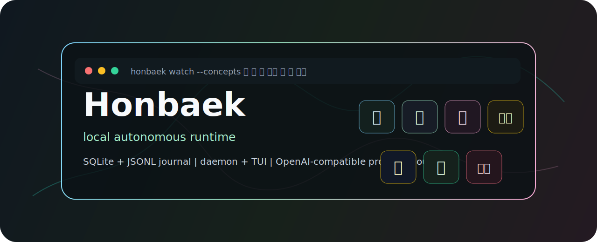

<p align="center">
  
</p>

<h1 align="center">Honbaek</h1>

<p align="center">
  <a href="https://github.com/aproto9787/honbaek/actions/workflows/ci.yml"></a>
  
  
  
  
</p>

<p align="center">
  <strong>혼백강령 as a local autonomous runtime.</strong><br>
  Organize active runtime subject, provider substrate, intent, commandments, local body, continuity, and anomalies without turning the machine into a hosted service.
</p>

---

## What It Is

Honbaek is a Rust CLI, daemon, and TUI-shaped runtime for local autonomous work. It keeps runtime state under `~/.honbaek/`, uses SQLite for structured state, and writes append-only JSONL journals for continuity.

The project is intentionally strange, but the implementation is practical: commands wake a local daemon, assign work, inspect state, watch the timeline, configure an OpenAI-compatible provider boundary, maintain `戒令` runtime rules, and record `怪異` anomalies when the runtime observes tension or failure.

## Concept Map

| Concept | Reading | Runtime Role |
| --- | --- | --- |
| `魂` | hon | Active runtime subject: a named local identity that can receive work. |
| `魄` | baek | Provider-backed capability substrate: model adapter and completion boundary. |
| `心` | sim | Current intent and self-check state. |
| `戒令` | gyeryeong | Runtime commandments: persistent local rules checked before work reaches `身`. |
| `身` | sin | Local body: filesystem, shell, network, and tool boundary. |
| `命` | myeong | Durable identity and journaled continuity. |
| `怪異` | kaeyi | Anomalous runtime entity discovered from failures, discontinuity, and provider/tool tension. |

## Install

```bash
cargo install --git https://github.com/aproto9787/honbaek
```

From a local checkout:

```bash
cargo build --release
target/release/honbaek --help
```

## Quick Start

```bash
honbaek awaken --name default --profile unbound
honbaek assign --hon default "create a short runtime status note for this workspace"
honbaek inspect
honbaek watch --once
honbaek watch
```

The daemon starts automatically when a command needs it.

## Watch Preview

`watch --once` gives a terminal snapshot of the local runtime timeline.

```text
혼백강령 watch
timeline:
- 命 [daemon.shutdown] honbaek daemon received shutdown
- 戒令 [gyeryeong.warn] 戒令 warning matched task prompt
- 怪異 [kaeyi.observed] 怪異 observed by local scan
current task:
- <task-id> completed create a short runtime status note for this workspace
provider usage: 0
failure recovery: journaled events available
戒令 summary:
- <rule-id> [warn enabled] No destructive prompt pattern=delete
怪異 summary:
- <kaeyi-id> [warning 發現] Provider fallback source=provider.not_configured
```

Run `honbaek watch` without `--once` for the live TUI.

## 戒令 Workflow

`戒令` records persistent local commandments that sit between `心` intent and `身` execution. Enabled rules are checked before assigned work reaches local tools.

```bash
honbaek gyeryeong add "No destructive prompt" \
  --pattern "delete" \
  --action warn \
  --rationale "operator review required"

honbaek gyeryeong add "Block forbidden prompt" \
  --pattern "forbidden-gyeryeong-smoke" \
  --action block \
  --rationale "blocking path smoke"

honbaek gyeryeong list
honbaek gyeryeong inspect <id>
honbaek gyeryeong disable <id>
honbaek gyeryeong enable <id>
```

`warn` records a `戒令` event and allows execution to continue. `block` records a `戒令` event, prevents local executor side effects, and marks the task failed with a blocked result. Any enabled rule match creates or updates a linked `怪異` record so policy tension is visible through `kaeyi`, `inspect`, and `watch`.

## 怪異 Workflow

`怪異` records runtime anomalies. It supports manual recording and local scans without destructive remediation.

```bash
honbaek kaeyi record "Manual omen" \
  --evidence "operator observed unexpected runtime tension" \
  --severity warning

honbaek kaeyi list
honbaek kaeyi inspect <id>
honbaek kaeyi contain <id> --note "held for observation"
honbaek kaeyi resolve <id> --note "explained by audit"
honbaek kaeyi scan
```

Lifecycle states are displayed with Hanja labels:

| State | Meaning |
| --- | --- |
| `發現` | Discovered |
| `觀測` | Observed |
| `封印` | Contained |
| `解消` | Resolved |
| `歸屬` | Attributed |

## Architecture

```text
honbaek CLI
    |
    | wakes / commands
    v
local daemon
    |
    +-- 魂 identity registry
    +-- 心 intent state
    +-- 魄 provider adapter
    +-- 戒令 runtime rule ledger
    +-- 身 local tool boundary
    +-- 命 SQLite + JSONL continuity
    +-- 怪異 anomaly ledger
```

The runtime is local-first. Provider calls are optional and isolated behind an OpenAI-compatible adapter. Secrets are read from environment variables and are not written into `~/.honbaek/config.toml`.

## Provider Configuration

```bash
export OPENAI_API_KEY="..."
export HONBAEK_OPENAI_MODEL="gpt-5.5"
```

Useful environment overrides:

| Variable | Purpose |
| --- | --- |
| `HONBAEK_HOME` | Override the runtime state directory. |
| `HONBAEK_PROVIDER` | Select the provider implementation. |
| `HONBAEK_OPENAI_BASE_URL` | Override the OpenAI-compatible API base URL. |
| `HONBAEK_OPENAI_MODEL` | Select the provider model. |
| `HONBAEK_OPENAI_API_KEY_ENV` | Read the API key from a named environment variable. |
| `HONBAEK_OPENAI_API_KEY` | Direct API key override for local sessions. |

## Service And Completions

Generate a systemd user service:

```bash
honbaek service print > ~/.config/systemd/user/honbaek.service
systemctl --user enable --now honbaek.service
```

Generate shell completions:

```bash
honbaek completions bash > honbaek.bash
honbaek completions fish > honbaek.fish
honbaek completions zsh > _honbaek
```

## Safety Boundaries

Honbaek observes, records, contains, and resolves local runtime state. `戒令` blocks stop work before local executor side effects, and `怪異` scan and containment paths do not automatically delete files, kill processes, mutate external services, or make destructive network changes.

Provider secrets should stay in the environment. Runtime state is designed for local use, not multi-user hosting.

## Verification

```bash
cargo fmt --check
cargo clippy --workspace --all-targets -- -D warnings
cargo test --workspace
cargo build --release
scripts/smoke.sh
```

CI runs the same core checks on every push.

## Roadmap

- Richer live TUI panes for `魂`, `戒令`, `命`, and `怪異`.
- Better provider usage accounting and failure attribution.
- More local scan sources for anomaly detection.
- Import/export tools for runtime journals.
- Packaged release artifacts for Linux workstations.

## License

MIT
